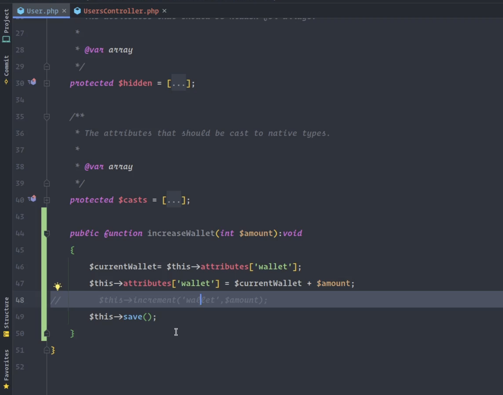
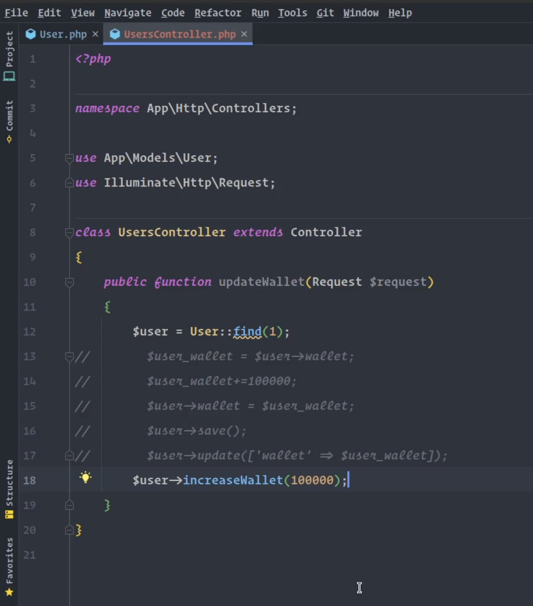

# Tell Don't Ask (TDA)

In Object-oriented programming, TDA (Tell Don’t Ask) means telling an object to perform an action rather than asking for information and taking action on behalf of the object.

### before

### after

